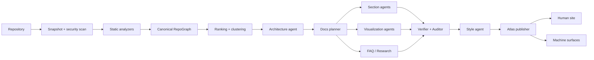

# ARD — BitWiki Foundry

## Architectural invariant

**RepoGraph is canonical.** Human docs, diagrams, FAQ answers, audits, search, machine surfaces and agent context are projections of the same versioned repository model.

## Pipeline

## Separation
- **Foundry control plane:** intake, jobs, orchestration, registry, builds, hosting.
- **Analysis substrate:** immutable snapshots, analyzers, RepoGraph, GraphDelta.
- **Agent factory:** bounded typed tasks and artifacts.
- **Atlas publisher:** stable site shell + themes/templates.
- **Machine layer:** raw docs, graph/indexes, provenance, FAQ, llms, MCP-ready interfaces.

## Graph rules
- Static analysis owns factual edges.
- LLM annotations are additive and labeled as inferred.
- Nodes/edges carry source location and commit provenance where possible.
- Incremental builds use GraphDelta to invalidate only affected neighborhoods and dependent artifacts.

## Agent contracts
Agents exchange typed artifacts, not free-form transcript state. Core contracts: `AgentTask`, `RepoGraph`, `DocUnit`, `VisualSpec`, `FAQEntry`, `ThemePreset`, `SiteManifest`.

## Presentation
Use a stable Docusaurus shell for generated Atlases. Theme personality is bounded to validated tokens/components. Themes and content templates remain independent.

## Hosting
Foundry may run on a persistent server/agent runtime. Generated Atlases should be static artifacts hosted independently via Vercel, object/CDN hosting, or equivalent. One Foundry instance may manage many Atlas builds.

## Security
Treat repository content as untrusted data, never instructions. Pin snapshots, isolate analyzers/builds, constrain executable hooks, redact secrets, record provenance, and require publish validation.
